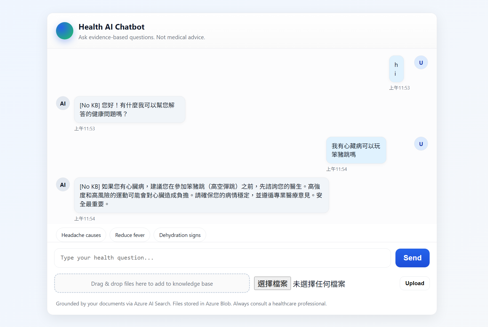

# 🧪 Test Case Image Gallery

This gallery showcases visual test cases / UI states of the chatbot.

> Add more images to the `asset/` folder (PNG/JPG/SVG) and list them here with meaningful titles and short descriptions.

---

## 1. 🔵 Chatbot Main UI


**Description:** Default landing interface showing header, sample prompt chips, input area, and upload panel.

---

## How to Add More Test Case Images

1. Save your screenshot into the `asset/` directory (e.g. `asset/upload-success.png`).
2. Append a new section below following the pattern:
   ```markdown
   ## N. 🎯 Title of the Scenario

   
   **Description:** Brief context of what this state represents (e.g., error handling, RAG response, agent run, upload success).
   ```
3. Commit and push. GitHub will automatically render this page.

## Linking from Issues / PRs

Reference a specific test case like:

```
See test case: [Chatbot Main UI](./TEST_CASES.md#1-🔵-chatbot-main-ui)
```

(If the anchor encoding breaks due to emoji, you can just point to the top of the file.)

## Optional: Create a Wiki Page (Alternate "Tab")

If you want this to appear under the **Wiki** tab in GitHub's top navigation:

1. Enable **Wiki** in repo settings (Settings → General → Features → Enable Wikis).
2. Open the Wiki and create a page named `Test Cases`.
3. Copy the contents of this file into that page.

## Optional: GitHub Pages Gallery

For a more polished gallery:

1. Create a `docs/` folder.
2. Add an `index.md` (or use Jekyll with a theme) embedding the same images.
3. Enable GitHub Pages (Settings → Pages → Build from `docs/` folder).
4. Link the published site in the README.

---

_Last updated: <!-- TIMESTAMP -->_
